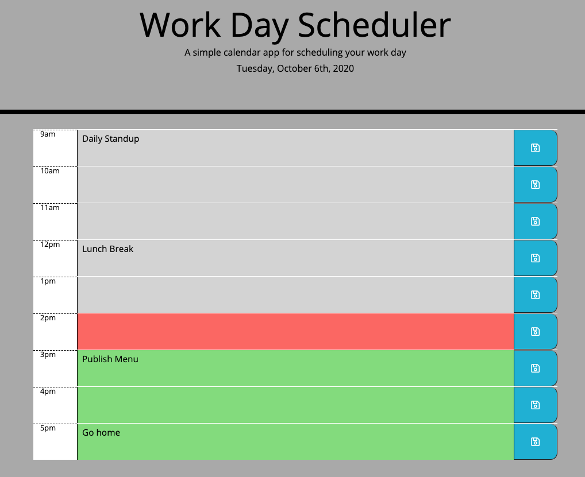

# Work Day Scheduler

## General info
A simple calendar application where you can enter and save events. A color code helps you see when the events are to take place.  

## Features

* Current date is displayed at the top of the sceduler.
* Past events in the past are colored grey.
* Current events are colored red.
* Future events are colored green.
* Text can be entered by clicking the time block. 
* You can save your text by clicking the save button.
* Events are saved in local storage.
	
## Technologies

Project is created with:

* Javascript
* JQuery
* CSS
* HTML